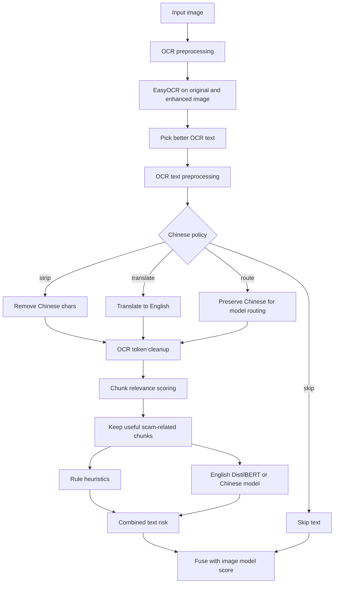

# CS3264_PhishingDetection

## 1. Create virtual environment
```bash
python -m venv venv
```

## 2. Activate environment
### Mac / Linux:
```bash
source venv/bin/activate
```

### Windows:
```bash
venv\Scripts\activate
```

## 3. Install dependencies
```bash
pip install -r requirements.txt
```

## 4. Run the application
```bash
python app.py
```

This will:
- Load the deepfake detection model
- Run inference on sample images
- Extract text using OCR
- Analyze OCR text for phishing-related signals
- Fuse image and text signals into a final phishing risk score

Text risk now combines:
- OCR preprocessing for screenshot text
- OCR text cleanup and Chinese handling (`strip`, `skip`, `translate`, or `route`)
- trusted-contact allowlist support for official emails and phone numbers
- trusted government-site allowlist support for official URLs
- optional Chinese-model routing for OCR text that still contains Chinese characters
- Relevance filtering to keep scam-indicative chunks and drop background/news noise
- Rule heuristics (keywords + URL/email/phone/money patterns)
- Pretrained English phishing text model: `cybersectony/phishing-email-detection-distilbert_v2.4.1`
- Experimental Chinese spam-email model: `jason23322/email-classifier-optimized`
- Weighted fusion of rule score and model score

## Current baseline

The project now uses a multimodal phishing baseline:
- Vision signal: pretrained deepfake/manipulation classifier
- Text signal: OCR plus preprocessing, relevance filtering, heuristics, allowlists, and bilingual text-model scoring
- Fusion: weighted combination into a low, medium, or high phishing risk score

This is still a practical baseline. Thresholds and weights should be calibrated with your own dataset.

## Text preprocessing pipeline

The text pipeline is designed for noisy screenshot-style phishing images where raw OCR often includes:
- location text
- article headlines
- logos and watermarks
- mixed English/Chinese text
- random corrupted OCR fragments

To make the text classifier more reliable, the project now applies multiple cleanup stages before model scoring:

1. OCR image preprocessing
   - Upscale the image
   - Convert to grayscale
   - Apply autocontrast, sharpening, and median filtering
   - Run OCR on both original and processed image, then keep the better result
2. OCR text preprocessing
   - Clean noisy OCR tokens
   - Preserve useful patterns like URLs, emails, phone numbers, and money mentions
   - Allowlist trusted government-site domains, trusted email domains, exact email addresses, and exact phone numbers so they do not raise heuristic risk on their own
   - Route cleaned Chinese text to a dedicated Chinese classifier when `OCR_CHINESE_POLICY=route`
   - Handle Chinese text with one of four modes:
     - `strip`: remove Chinese characters but keep the rest of the OCR text
     - `skip`: skip the text if Chinese is detected
     - `translate`: translate Chinese text to English before scoring
     - `route`: preserve Chinese text and send Chinese-containing chunks to the Chinese classifier
3. Relevance filtering
   - Split OCR text into chunks
   - Score each chunk for scam relevance
   - Keep scam-like chunks such as `verify now`, `account frozen`, `WhatsApp`, `click link`
   - Drop low-value chunks such as news/location/background text
4. Text scoring
   - Rule-based phishing indicators
   - Trusted government sites and trusted contacts removed from URL/email/phone heuristic boosts
   - Trusted government sites and contacts optionally masked before phishing-model scoring
   - DistilBERT phishing-text probability for English text
   - Chinese model probability for Chinese-containing text when routing is enabled
   - Weighted combination into final text risk

### Trusted contact allowlist

You can configure known-safe contacts in `utils/config.py`:

- `TRUSTED_EMAIL_ADDRESSES`: exact email addresses
- `TRUSTED_EMAIL_DOMAINS`: domain suffixes such as `gov.sg`
- `TRUSTED_PHONE_NUMBERS`: exact phone numbers after normalization
- `TRUSTED_URL_DOMAINS`: trusted site domains such as `gov.sg`
- `MASK_TRUSTED_CONTACTS_FOR_MODEL`: replace trusted contacts with placeholders before model scoring
- `CHINESE_TEXT_PHISHING_MODEL_NAME`: experimental Chinese spam/scam proxy model
- `CHINESE_TEXT_MODEL_POSITIVE_CLASS_INDEX`: positive spam/scam class index for that model

The seeded defaults now include a small Singapore-government allowlist based on official public contact pages. These entries suppress the URL/email/phone heuristic boosts, but they do not force the sample to be classified as safe if the rest of the text still looks suspicious.

### Pipeline diagram



## Evaluate text accuracy

To evaluate the text pipeline on labeled phishing vs non-phishing folders:

```bash
python scripts/evaluate_distilbert_accuracy.py --chinese-policy strip
```

Useful options:

```bash
python scripts/evaluate_distilbert_accuracy.py --chinese-policy strip --show-chinese-samples 5
python scripts/evaluate_distilbert_accuracy.py --chinese-policy strip --show-used-images
python scripts/evaluate_distilbert_accuracy.py --chinese-policy translate --show-chinese-samples 5
python scripts/evaluate_distilbert_accuracy.py --chinese-policy route --show-chinese-samples 5
```

Example result after OCR cleanup and relevance filtering:
- Accuracy: `92.55%`
- Precision (phishing): `98.18%`
- Recall (phishing): `90.00%`

This makes the text pipeline much more robust on noisy screenshot datasets where raw OCR alone is not reliable.