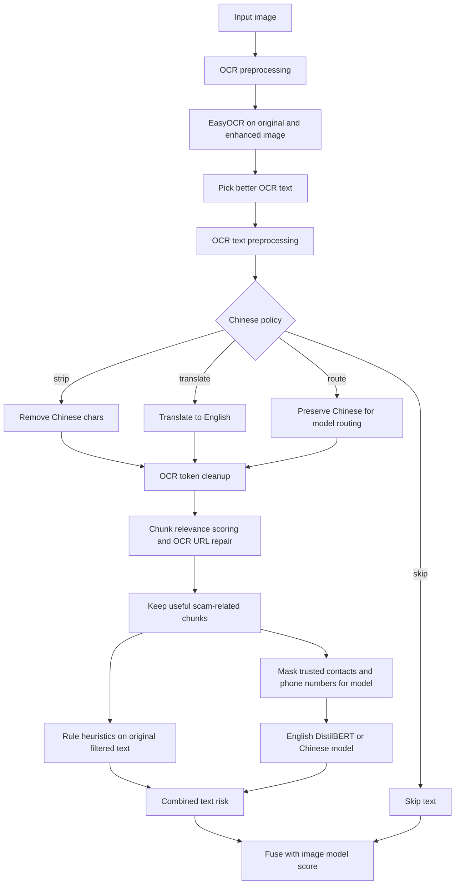

# CS3264_PhishingDetection

## 1. Create virtual environment
```bash
python -m venv venv
```

## 2. Activate environment
### Mac / Linux:
```bash
source venv/bin/activate
```

### Windows:
```bash
venv\Scripts\activate
```

## 3. Install dependencies
```bash
pip install -r requirements.txt
```

## 4. Run the application
```bash
python app.py
```

This will:
- Load the deepfake detection model
- Run inference on sample images
- Extract text using OCR
- Analyze OCR text with a screenshot-aware phishing pipeline
- Fuse image and text signals into a final phishing risk score

Text risk now combines:
- OCR preprocessing for screenshot text
- OCR token cleanup and Chinese handling (`strip`, `skip`, `translate`, or `route`)
- trusted-contact and trusted-domain allowlists for official URLs, emails, and hotlines
- phone-number masking before model scoring
- relevance filtering to keep scam-indicative chunks and drop background/news noise
- OCR-tolerant URL recovery for merged domains such as `foo.comregister`
- rule heuristics (keywords + URL/email/phone/money patterns)
- pretrained English phishing text model: `cybersectony/phishing-email-detection-distilbert_v2.4.1`
- experimental Chinese spam-email model: `jason23322/email-classifier-optimized`
- weighted fusion of rule score and model score

## Current defaults

The project uses a multimodal phishing pipeline:
- Vision signal: pretrained deepfake/manipulation classifier
- Text signal: OCR plus preprocessing, relevance filtering, heuristics, allowlists, masking, and bilingual text-model scoring
- Fusion: weighted combination into a low, medium, or high phishing risk score

Current text defaults in `utils/config.py`:
- `TEXT_RULE_WEIGHT = 0.2`
- `TEXT_MODEL_WEIGHT = 0.8`
- `MEDIUM_RISK_THRESHOLD = 0.75`
- `MODEL_POSITIVE_THRESHOLD = 0.6`
- `MASK_TRUSTED_CONTACTS_FOR_MODEL = True`
- `MASK_ALL_PHONE_NUMBERS_FOR_MODEL = True`

These values were chosen after evaluating both the original labeled set and the social screenshot set. If you change the weights, you should re-tune the threshold as well.

## SigLIP embedding baseline

The `siglip/` folder contains a separate baseline for screenshot scam detection:
- Extract image embeddings with `google/siglip2-base-patch16-224`
- Train a shallow classifier on top of the frozen embeddings
- Compare `logreg`, `lightgbm`, and `xgboost` on the same train/val/test splits

Expected dataset layout:

```text
data/sglip/
  train/
    real/
    fake/
  val/
    real/
    fake/
  test/
    real/
    fake/
```

Commands:

```bash
python scripts/split_siglip_dataset.py
python siglip/extract_embeddings.py
python siglip/train_classifier.py --model logreg
python siglip/train_classifier.py --model lightgbm
python siglip/train_classifier.py --model xgboost
python siglip/evaluate.py --model xgboost
python siglip/inference.py --image path/to/screenshot.png --model xgboost
```

Notes:
- Device auto-detects to `cuda`, `mps`, or `cpu`
- Override device manually with `SIGLIP_DEVICE=cpu`
- LightGBM and XGBoost require the packages from `requirements.txt`

## Text preprocessing pipeline

The text pipeline is designed for noisy screenshot-style phishing images where raw OCR often includes:
- location text
- article headlines
- logos and watermarks
- mixed English/Chinese text
- random corrupted OCR fragments

To make the text classifier more reliable, the project now applies multiple cleanup stages before model scoring:

1. OCR image preprocessing
   - Upscale the image
   - Convert to grayscale
   - Apply autocontrast, sharpening, and median filtering
   - Run OCR on both original and processed image, then keep the better result
2. OCR text preprocessing
   - Clean noisy OCR tokens
   - Preserve useful patterns like URLs, emails, phone numbers, and money mentions
   - Allowlist trusted government-site domains, trusted email domains, exact email addresses, and exact phone numbers so they do not raise heuristic risk on their own
   - Mask all detected phone numbers before sending text to the language model
   - Route cleaned Chinese text to a dedicated Chinese classifier when `OCR_CHINESE_POLICY=route`
   - Handle Chinese text with one of four modes:
     - `strip`: remove Chinese characters but keep the rest of the OCR text
     - `skip`: skip the text if Chinese is detected
     - `translate`: translate Chinese text to English before scoring
     - `route`: preserve Chinese text and send Chinese-containing chunks to the Chinese classifier
   - Only route to the Chinese model when the text is meaningfully Chinese-heavy, instead of switching models because of one stray Chinese character
3. Relevance filtering
   - Split OCR text into chunks
   - Score each chunk for scam relevance
   - Keep scam-like chunks such as `verify now`, `account frozen`, `WhatsApp`, `click link`
   - Repair OCR-merged domains such as `foo.comregister` so URL signals are not lost
   - Drop low-value chunks such as news/location/background text
4. Text scoring
   - Rule-based phishing indicators
   - Trusted government sites and trusted contacts removed from URL/email/phone heuristic boosts
   - Trusted government sites and contacts optionally masked before phishing-model scoring
   - Benign-context penalties only apply when there are no strong phishing blockers such as `WhatsApp`, `Telegram`, `action required`, or `account verification`
   - DistilBERT phishing-text probability for English text
   - Chinese model probability for Chinese-containing text when routing is enabled
   - Weighted combination into final text risk

### Trusted contact allowlist

You can configure known-safe contacts in `utils/config.py`:

- `TRUSTED_EMAIL_ADDRESSES`: exact email addresses
- `TRUSTED_EMAIL_DOMAINS`: domain suffixes such as `gov.sg`
- `TRUSTED_PHONE_NUMBERS`: exact phone numbers after normalization
- `TRUSTED_URL_DOMAINS`: trusted site domains such as `gov.sg`
- `MASK_TRUSTED_CONTACTS_FOR_MODEL`: replace trusted contacts with placeholders before model scoring
- `MASK_ALL_PHONE_NUMBERS_FOR_MODEL`: replace all detected phone numbers with `[PHONE_NUMBER]` before model scoring
- `CHINESE_TEXT_PHISHING_MODEL_NAME`: experimental Chinese spam/scam proxy model
- `CHINESE_TEXT_MODEL_POSITIVE_CLASS_INDEX`: positive spam/scam class index for that model
- `CHINESE_ROUTE_MIN_CHAR_COUNT` / `CHINESE_ROUTE_MIN_CHAR_RATIO`: minimum Chinese content required before routing to the Chinese model

The seeded defaults now include a small Singapore-government allowlist based on official public contact pages. These entries suppress the URL/email/phone heuristic boosts, but they do not force the sample to be classified as safe if the rest of the text still looks suspicious.

### Pipeline diagram



## Evaluate text accuracy

To evaluate the text pipeline on labeled phishing vs non-phishing folders:

```bash
python scripts/evaluate_distilbert_accuracy.py --chinese-policy route
```

Useful options:

```bash
python scripts/evaluate_distilbert_accuracy.py --chinese-policy route --show-chinese-samples 5
python scripts/evaluate_distilbert_accuracy.py --chinese-policy route --show-used-images
python scripts/evaluate_distilbert_accuracy.py --chinese-policy route --decision-source model --threshold 0.90
python scripts/evaluate_distilbert_accuracy.py --phishing-dir data\social_negative_sample --non-phishing-dir data\social_positive_sample --chinese-policy route
```

Notes:
- `--decision-source combined` is the default and uses the weighted rule/model score.
- `--decision-source model` evaluates the text model alone after OCR cleanup, chunk selection, and masking.
- If you increase model weight heavily, you should raise the decision threshold too. A low threshold such as `0.4` tends to over-predict phishing on screenshot-style social posts.
- The evaluator reports how many images actually contained usable OCR text. Some images may be skipped if OCR returns nothing meaningful.

This pipeline is designed to be more robust on noisy screenshot datasets where raw OCR text alone or model-only scoring is not reliable.
